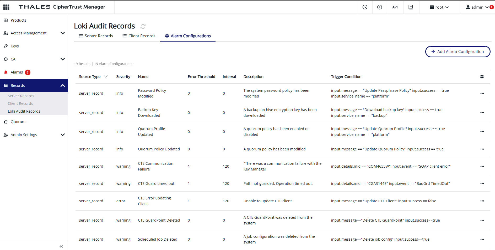

# Import Recommended CipherTrust Event Alarm Configurations

> ⚠️ **Disclaimer:** This script is an independent development and is not affiliated with, endorsed, approved, or supported by Thales Cyber Security Products (Thales CSP). Use this script at your own risk. We disclaim any responsibility for any issues, damages, or liabilities that may arise from its use.

This script uses the KSCTL command line utility to import recommended event alarm configurations into the **Thales CipherTrust Data Security Platform**. 

Event alarms should be restricted to events you need the CipherTrust administrators to be aware of - configuration changes or unsafe behavior. Standard event correlation, dashboards and reporting are typically done by forwarding CipherTrust log records to your SIEM or log analyitics solution. 

🔗 For more information on event alarm configurations: [Thales Docs Portal](https://thalesdocs.com/ctp/cm/latest/admin/cm_admin/monitoring/records/index.html#configuring-alarm-triggers-based-on-a-record)

The following alert configs are defined:

 - Backup Key Downloaded
 - Certificate Deleted
 - Client Deleted
 - CTE Communication Failure
 - CTE Error updating Client
 - CTE Guard timed out
 - CTE GuardPoint Deleted
 - Interface Created
 - Interface Deleted
 - Interface Modified
 - Key Deleted
 - Local CA Created
 - Local CA Deleted
 - Password Policy Modified
 - Quorum Policy Updated
 - Quorum Profile Updated
 - Scheduled Job Deleted
 - Weak AES key created
 - Weak RSA key created
